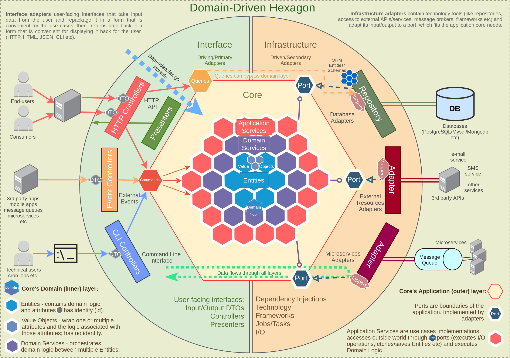

# Architecture
The architecture of this application is inspired by the [Domain Driven Hexagon](https://github.com/Sairyss/domain-driven-hexagon). You will find some similarities but not all the Domain Driven Hexagon is implemented, **it's an adaptation to meet our needs.**

## Modules
This project's code examples use separation by modules (also called components). Each module gets its own folder with a dedicated codebase, and each use case inside that module gets it's own folder to store most of the things it needs (this is also called Vertical Slicing).

It is easier to work on things that change together if those things are gathered relatively close to each other. Try not to create dependencies between modules or use cases, move shared logic into a separate files and make both depend on that instead of depending on each other.

Try to make every module independent and keep interactions between modules minimal. Think of each module as a mini application bounded by a single context. Try to avoid direct imports between modules (like importing a service from other domain) since this creates tight coupling. Communication between modules can be done using events, public interfaces or through a port/adapter.

## Use cases
- Typically used to orchestrate how the outside world interacts with your application and performs tasks required by the end users / services.
- Should not depend on other application services since it may cause problems (like cyclic dependencies);

::: details What are "Use cases"? 
Wikipedia says:
> In software and systems engineering, a use case is a list of actions or event steps typically defining the interactions between a role (known in the Unified Modeling Language as an actor) and a system to achieve a goal.
:::

## Business
Business is also called Domain Services is the DDD world.

Eric Evans, Domain-Driven Design:
> Domain services are used for "a significant process or transformation in the domain that is not a natural responsibility of an ENTITY or VALUE OBJECT"

- Domain Service is a specific type of domain layer class that is used to execute domain logic that relies on two or more `Entities`.
- Domain Services are used when putting the logic on a particular `Entity` would break encapsulation and require the Entity to know about things it really shouldn't be concerned with.
- Domain services operate only on types belonging to the Domain.

