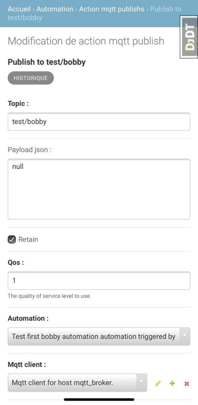

# Automations 
[[toc]]

## Introduction
The idea behind automations is to allow you to automatically respond to things that happen.
Thanks to Automations you can extend Bobby so you can **build whatever you want**.

As of today, we only support one action:
- mqtt publish

and two triggers:
- on_motion_detected
- on_motion_left

Examples:
- publish mqtt message when a motion is detected and when people left: outside of Bobby you can use this event to turn the lights on, trigger your speakers and so on.

## Creating automations
As of today, you can only create automations *(and related objects)* through the django admin.

1) Create your Automation thanks to the corresponding page.
2) Create your Actions that you will link to the Automation. Actions will be executed when Automations are triggered.

Enjoy :rocket:

## Why?
We aim to keep the code base of Bobby as easy and little as possible.

For instance, we don't and won't allow you to control your connected lights but you can thanks to an Automation.

So basically, we won't implement a ton of features but we give you the tools to create them easily.
