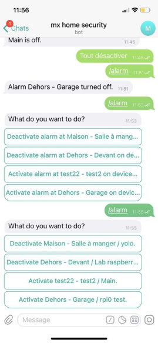

# Telegram

## Known limitations
### Inline keyboard truncate words

When an Inline keyboard contains too many characters for the screen, Telegram truncates characters. Here is an example:

That leads to a poor user experience because we can't read properly...

We cannot change this behavior, we could with `ReplyKeyboard` but it does not correspond to our needs. See the related issue.

::: tip Avoid truncate
To avoid this behavior we simply reduce the number of characters. It is not optimal at all but at least it works.
:::

Related bobby issue:
- [Telegram bot with ReplyKeyboardMarkup and KeyboardButton instead of Inline variants](https://github.com/mxmaxime/bobby-home/issues/194)

Sources:
- [Newline in telegram inline keyboard for python](https://stackoverflow.com/questions/46917909/newline-in-telegram-inline-keyboard-for-python/62895743#62895743)
- [Telegram Bot InlineKeyboardButton Full Text](https://stackoverflow.com/questions/50960125/telegram-bot-inlinekeyboardbutton-full-text)

### No multi select
For example, we would like to allow the resident to select multiple alarm actions at once, but it is not possible with telegram. People found some workaround but it adds complexity that we don't want for this.

Sources:
- [How to display multiselect or checkboxes](https://github.com/php-telegram-bot/core/issues/307) issue created for PHP telegram bot but it is linked to the telegram API which does not provide a way to add multiselect/checkboxes.
