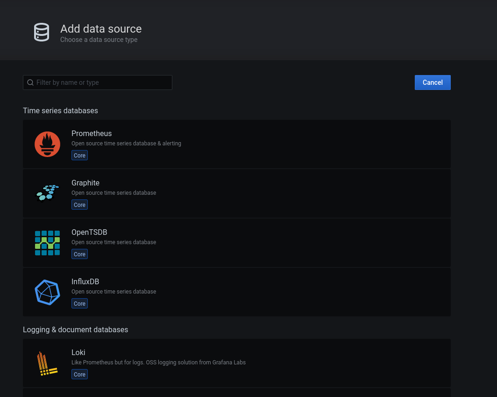
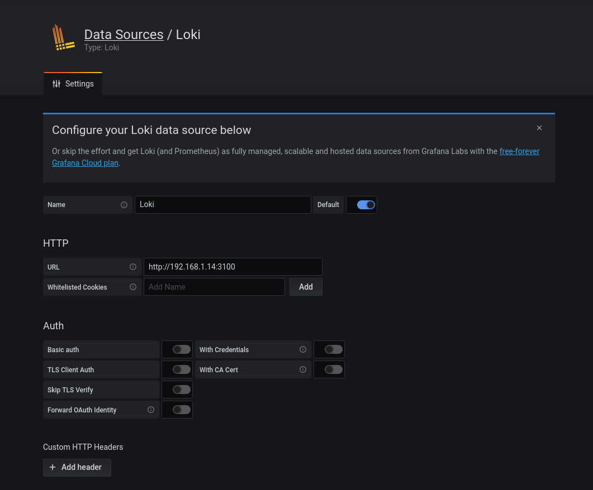
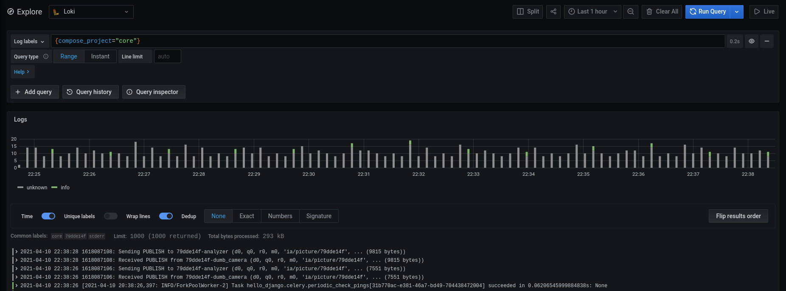

# Setup your grafana

Bobby home uses Grafana to observe the system, specially to see logs.

Grafana is accessible through the port 3000. So you can connect to it by opening your browser and going to: `http://<ip>:3000`.

Of course take the IP that hosts the Grafana container.

It allows us to watch logs from every device. For example, if you have many smart-cameras this is handy useful because you do not have to log to every raspberry pis to check what is going on.

::: tip Remember
Remember: default login/password are admin/admin. Useful for your first connection.
:::

## Reset Grafana password
Just in case you loose your Grafana password, you can reset it:

```
docker exec -it <name of grafana container> grafana-cli admin reset-admin-password <fill in password>
```


## Connect Loki data source
To be able to visualise your logs, you have to connect the Loki data source. To do so, go to "Configuration (cogwheel) > Data sources" and select "Loki".


Then you have to configure the URL, which is your core raspberry pi IP *(which hosts grafana, loki, the web app...)* and precise the loki port which is 3100 like this example:


At the bottom of the page you can "Save & Test", and if everything is fine it should say you with some green alerts.

At this point Grafana is able to query Loki and allows you to visualize your logs.

To start quickly to investigate your logs, you can go to "Explore (compass icon)", and select "Loki" at the top. Here is an example:



You can now query your logs. Grafana helps you thanks to "Log Labels". Enjoy!