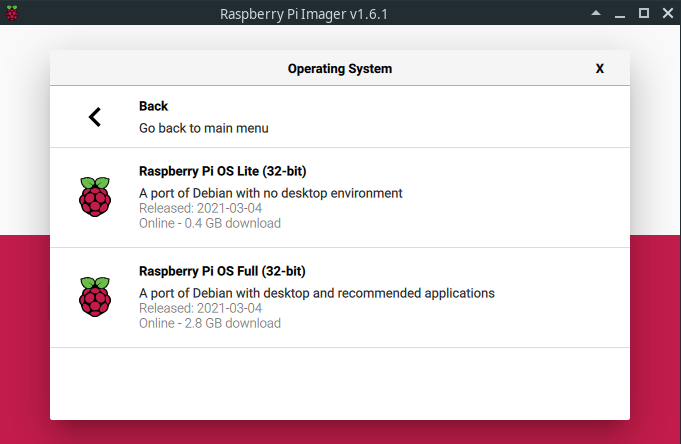

# Setup - Prepare your RaspberryPis
[[toc]]

## Introduction
This page gives you the steps to follow to install your raspberry pi 4/3 or your raspberry pi zero. At the end, you will have your beloved raspberry pi up and running connected to your network.

## Burn the RaspberryPi OS to sd card

1. Insert your sd card in your computer.
2. Download the [Raspberry Pi Imager.](https://www.raspberrypi.org/software/)
3. Launch the Raspberry Pi Imager, go in "RaspberryPi OS (other)" and select Raspberry Pi OS Lite.



Let it write! It will notify you when it's done.

## Setup network connexion

### Enable SSH
Create a file named `ssh` in the boot folder of the SD card. This will enable ssh.

### WiFi
To add network info you need to create a second text file called `wpa_supplicant.conf` and place that in the root of the boot SD as the `ssh` file.

```
country=FR
ctrl_interface=DIR=/var/run/wpa_supplicant GROUP=netdev
update_config=1
network={
    ssid="Your SSID"
    psk="YourWPAPassword"
    key_mgmt=WPA-PSK
}
```

### Create static ip
On your network you have a DHCP server that delivers IP to devices.

It is very useful to have your raspberrypis assigned to a static ip, that means that the IP will never change because the DHCP server knows what IP to assign to this device. This is totally dependent from your network, generally your DHCP server is provided by your router. Get information about it and assign a static ip for every device of this system.

:::danger
DHCP assigns an IP to a MAC address so if the mac address change, the IP change. 
It is the case if you change the network interface: you decide to go from WiFi to eth link. In this case you can change the static ip to reflect the mac address change, it's up to you.
:::

### Find your raspberry pi on your LAN
When your raspberry is connected to your network (LAN), you'll be able to connect to it remotly through SSH. But to do so... You need its ip address. You can use your router to find its ip or you can use `nmap` to analyze your network and find it. Example:
```
sudo nmap -sn 192.168.1.255/24
```
Where `192.168.1.255/24` is my network broadcast ip/mask ([CIDR notation](https://en.wikipedia.org/wiki/Classless_Inter-Domain_Routing)). I usually find this information thanks to `ip a`: `...brd 192.168.1.255`.

Results:
```
❯ sudo nmap -sn 192.168.1.255/24
Starting Nmap 7.91 ( https://nmap.org )
MAC Address: <mac> (Raspberry Pi Trading)
Nmap scan report for raspberrypi.home (192.168.1.20)
Host is up (0.13s latency).
MAC Address: <mac> (Raspberry Pi Trading)
Nmap scan report for mx-pc.home (192.168.1.10)
Host is up.
Nmap done: 256 IP addresses (x hosts up) scanned in 5.41 seconds
```

Then you can connect to your raspberry pi using its ip address, example:

```
❯ ssh pi@192.168.1.20           
The authenticity of host '192.168.1.20 (192.168.1.20)' can't be established.
ED25519 key fingerprint is SHA256:<fingerprint>.
This key is not known by any other names
Are you sure you want to continue connecting (yes/no/[fingerprint])? yes
Warning: Permanently added '192.168.1.20' (ED25519) to the list of known hosts.
pi@192.168.1.20's password: 
```

:::tip Default password
The default password is `raspberry`
:::

### SSH Keys
I suggest you (strongly recommend), to activate SSH connexion with ssh keys.
That can be done easily by the [`setup-ssh-keys.sh`](https://github.com/bobby-home/bobby-home).
Run the script and let yourself be guided.

If you ask to create a config file for the remote host (Do you want to create a config file for this remote host? y/n -> y), you will be able to give it an hostname. For example: `prod_main_pi`, then you will be able to connect like this: `ssh pi@prod_main_pi`. This is handy to deal with name instead of IP.

## Raspi config
We need to configure a little bit the raspberry.

```
sudo raspi-config
```

- "Advanced Options" -> Expan filesystem ensures that all of the SD card storage is available to the OS (then reboot).

## Docker stats reports zero memory usage
:::warning Only for raspberry pi 4/3
This step is only for raspberry pi 4/3 as docker is not used on raspberry pi zero.
:::

If you want to use `docker stats`, it does not work properly by default, you won't be able to see memory usage.


Fix it by adding this the following instructions at the end of the cmdline.txt file.

```
cgroup_enable=cpuset cgroup_enable=memory cgroup_memory=1
```

Then it should work.

Related github issues:
- [docker stats CONTAINER reports zero memory usage](https://github.com/moby/moby/issues/18420)
- [docker stats doesn't report memory usage on arm64](https://github.com/docker/for-linux/issues/1112)
