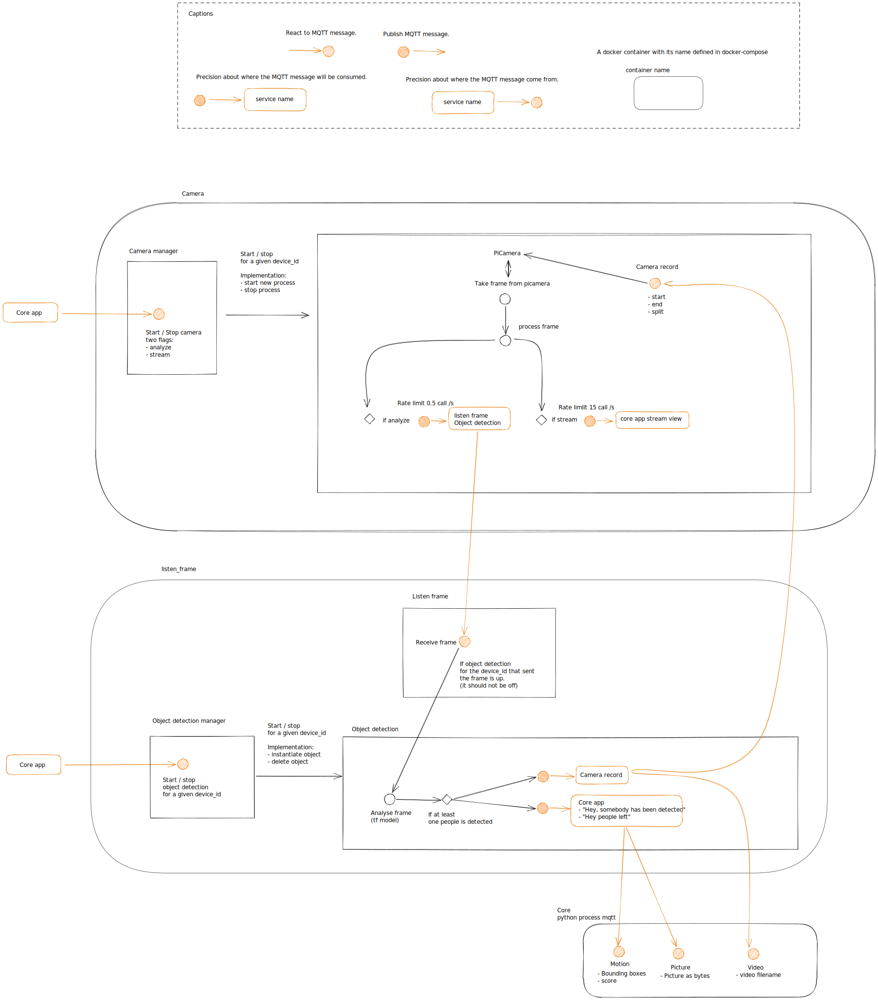

# Architecture

Our smart-camera software is composed by two services managed by the `core` application.
- camera: its job is to take frame on a device. Currently we only support PiCamera.
- listen_frame, object_detection: it receives pictures as bytes, analyses these frames and notify the `core` application if some people are detected.

## Why a decentralized architecture?
At the beginning of this project, we were working with only one PiCamera directly connected to the same RaspberryPi hosting the core application. It was the very first step of the project, to make sure it was viable.

Then, at the beginning of 2021, we added the possibility to have remote cameras connected to a raspberrypi zero. The goal was to be able to have multiple cameras without exploding the budget. To acheive this goal, we had to introduce this decentralized architecture.

Thanks to this, we could introduce any camera, they only need to publish to a particular mqtt topic. In the future, we will integrate esp cameras which are cheaper than raspberry pi zero with a picamera.

If you have a lot of cameras, up to 4, then you might need to run the listen_frame service on another Raspberry Pi 4 than the one hosting the core application. And more! Thanks to MQTT v5, we could even distribute our frames to be analyzed on different Raspberry Pis, creating a cluster, to analyze 10-20-infinite cameras! We will see in the future.

More information:
- [Github PR #141: Introduction of remote/dumb cameras.](https://github.com/mxmaxime/bobby-home/pull/141)
- [Github PR #170: Remove specific code to manage camera on the same rpi to use the decentralized architecture.](https://github.com/mxmaxime/bobby-home/pull/170)
- [Github PR #132 introduced a lot of removed code by the PR #170. Python multi processing to be able to record video and process frames (differents python processes.](https://github.com/mxmaxime/bobby-home/pull/132)

Actually, the PR 170 removed all the specific code with multi processing and improved the code.
We know have the cameras handling the PiCamera and the recording, and the listen_frame/object_detection handling the object detection through Tensorflow. It's well separated.

## Monitoring
As this decentralized architecture introduced new risks *(i.e a service crashes, don't respond when the core says to up/off a service...)*, we introduced monitoring mechanisms in the core application.

Every action is monitored so we are sure, at running time, that everything works.

[More information on the dedicated documentation page.](../core/monitor-mqtt-services.md)
